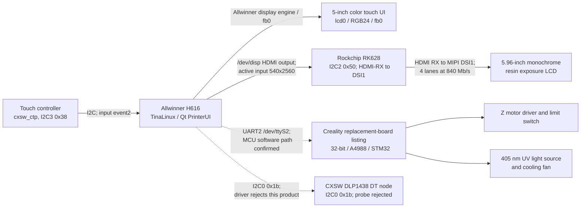

# Hardware map

## System topology

The operator-screen path is the H616 display engine's `lcd0`/`fb0` output. The live kernel log confirms a second active path: H616 HDMI output at 540×2560, RK628 HDMI receive, then RK628 MIPI DSI1 at four 840 Mb/s lanes. This mode matches PrinterUI's 1620-to-540 compressed layer width. The internal board HDMI routing and final panel FPC were not inspected physically, so those board-level connections remain inferred from the active signal and software profile. The DLP-named image backend is a model-dependent app branch, not evidence that the CL60 uses a DLP panel. Creality's replacement-board listing identifies an STM32 and A4988, but the silkscreen on this individual printer has not been photographed.

## Display 1: operator touchscreen

- Published HALOT-ONE specification: 5-inch touch screen.
- Published spare-part description identifies a color touch panel; the user manual calls its motherboard connection `RGB screen port`.
- Live OS observation: `/dev/fb0` reports `800x480p-59`, 32 bits per pixel, virtual size `800x960`. The flattened device tree has enabled Allwinner `lcd0`, active size `800x480`, physical dimensions `108x65 mm`, 30 MHz pixel clock, and the `rgb24` pin group. This supports the H616-to-RGB operator-panel path; board-level connector pin numbers have not been traced.
- Live OS observation: input device `cxsw_ctp` is attached to I²C bus 3 at address `0x38` and appears as `/dev/input/event2`.
- While PrinterUI was running, its open file descriptors included `/dev/fb0`, `/dev/disp`, `/dev/ion`, `/dev/mali0`, `/dev/input/event2`, and `/dev/ttyS2`.
- `SerialPortPrintFile` passes layer images through `SendBgraImage`. The active CL60 profile selects the generic `CreateVideoOutport`/ION display path; PrinterUI reduces the 1620-pixel source width to 540 pixels. The other `CreatevDlpOutport` branch is model-dependent.
- The I²C binding identifies the touch controller driver name, but not the exact chip vendor/model.

## Display 2: resin exposure panel

- Published HALOT-ONE specification: 5.96-inch monochrome LCD, 1620x2560 pixels; exposure wavelength is 405 nm.
- The user manual labels a separate motherboard connection `LCD resin panel` / `printing screen port`.
- Live kernel log: H616 HDMI output is enabled; RK628 at I²C2 `0x50` detects an HDMI input of 540×2560 (74.25 MHz), configures a 540×2560 destination (80.035 MHz), and initializes DSI1 at 840 Mb/s × 4 lanes. The RK628 sysfs `dsi_err` counter reads `0`. This establishes the active video bridge path at the Linux/display-link level.
- The loaded RK628 driver module contains a product-screen table entry `CL60R channel=0 type=1`; the live driver log reports the same product, channel, and type. This confirms which driver profile is selected, but the `type=1` value has not been mapped to a panel vendor or a specific init-sequence table.
- PrinterUI's CL60 image path produces a 540×2560 stream from 1620×2560 layer data, a 3:1 horizontal compression. The matching live RK628 input mode strongly identifies this as the exposure-image stream. The exact RGB-channel-to-monochrome-pixel mapping inside the bridge/panel is still unverified.
- The I²C0 node `compatible = "cxsw,dlp1438"` at `0x1b` is present in the device tree but its driver probe logs `device not the CD60` and fails with `-22`; no driver is bound. Its `power`, `spi_ready`, and `print_status` properties therefore do not establish an active CL60 display route.
- RK628 sysfs exposes `lcd_timing`, `lane_rate`, `dsi_enable`, `hdmi_out_enable`, and `dsi_err`. The first four return `EIO` on read in this firmware; `dsi_err` returns `0`. No values were written to those controls.
- The exact panel vendor, physical FPC pinout, and board-level trace from the RK628 DSI1 pads to the exposure panel remain unconfirmed because the printer has not been opened.

## Printer-control board and actuators

Creality lists replacement part `4002010045` as `HALOT-ONE Mainboard Kit_2.0_32_A4988_STM32`. The CL-60 wiring diagram labels these ports:

- RGB screen
- LCD resin panel / print screen
- Z-axis motor driver
- Z-axis upper limit switch
- UV LED power enable
- UV/light-board cooling fan
- exhaust fan
- DC power input
- USB host for a flash drive
- spare firmware/debug interface (manufacturer-only)

The downloaded rootfs includes an STM32 updater and `V1-01.bin`, confirming a distinct STM32 application firmware path. Its startup script selects the H616 UART `/dev/ttyS2` for this product and toggles H616-side GPIOs `PA6` (BOOT0) and `PA0` (reset) when entering the STM32 ROM updater. The exact MCU part number, clock, PCB revision, board connector, MCU UART pins, voltage levels, and electrical assignments have not been confirmed on this unit. The `A4988` designation is part of the vendor's replacement-board name; it does not establish the exact number of populated driver chips or connector pinout on this PCB revision.

## Linux-side buses observed

| Bus/device | Live name | Current interpretation |
|---|---|---|
| I²C 0, `0x1b` | `cxsw,dlp1438` | DT node exists; probe rejects product as `not the CD60` (`-22`); no bound driver |
| I²C 2, `0x50` | `rockchip,rk628` | Bound to `rk628`; live HDMI-RX 540×2560 to DSI1, 4 × 840 Mb/s; active exposure-image route with high confidence |
| I²C 3, `0x38` | `cxsw_ctp` | Touch input controller; `/dev/input/event2` |
| I²C 5, `0x36` | `axp806` | Power-management IC driver name |
| UART | `ttyS0`, `ttyS1`, `ttyS2` | `ttyS0` is the Linux console; PrinterUI and the STM32 updater use `/dev/ttyS2` for the control path; physical endpoint, connector, signal level, and MCU pins remain untraced |

These names are Linux driver/client labels observed under `/sys/bus/i2c/devices`; they are not all independently confirmed silicon part numbers.

## Physical verification needed

The printer has not been opened. The next useful evidence, if the owner later chooses to open it, is a sharp photo of both sides of the printer-control PCB, readable MCU and driver markings, and both screen cables at their connectors. Until then, PCB revision, cable destinations, connector pin numbers, and STM32 UART pins remain unconfirmed; the manual's port names and the live Linux-side interfaces are documented separately.

## Sources

- [HALOT-ONE user manual](https://www.bhphotovideo.com/lit_files/839713.pdf)
- [Creality HALOT-ONE mainboard kit](https://www.crealitycloud.com/product/spare-parts/halot-one-mainboard-kit-62ee0546a99b803c8f3f4513)
- [Creality HALOT-ONE product specifications](https://www.creality.com/download/creality-halot-one-resin-3d-printer)
- [Creality wiring/UV troubleshooting diagram](https://wiki.creality.com/en/halot-series/halot-series-general-troubleshooting/the-uv-light-remains-on-even-after-turning-off-the-clear-screen-or-completing-the-print)
- [Rockchip RK628D video-bridge overview](https://www.rock-chips.com/a/cn/news/rockchip/2021/0402/1383.html)
- [UART, STM32 command, and ROM-loader protocol findings](protocols.md)
- [Firmware/update chain and boot path](firmware-update.md)
