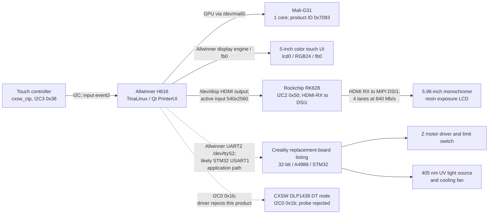

# Hardware map

## System topology

The operator-screen path is the H616 display engine's `lcd0`/`fb0` output. The live kernel log confirms a second active path: H616 HDMI output at 540×2560, RK628 HDMI receive/scaler path, then RK628 MIPI DSI1 at four 840 Mb/s lanes. This mode matches PrinterUI's 1620-to-540 compressed layer width at the HDMI input. Static RK628 table tracing maps live `CL60R channel=0 type=1` to the `panel_cmd_init_seq_tm89` command sequence and, through a separate timing lookup, to `dst_mode_boe_5_96` at 540×2560/112 MHz. The live `src`/`dst` log reports HDMI-path dimensions and clocks, not the DSI pixel clock; the current runtime timing override cannot be read. The compiled DSI timing and actual runtime override therefore remain separately recorded. The internal board HDMI routing and final panel FPC were not inspected physically, so those board-level connections remain inferred from the active signal and software profile. The DLP-named image backend is a model-dependent app branch, not evidence that the CL60 uses a DLP panel. Creality's replacement-board listing identifies an STM32 and A4988, but the silkscreen on this individual printer has not been photographed.

A read-only LAN shell session on 2026-09-29 reconfirmed TinaLinux `Neptune 272`, kernel `4.9.170`, and the H616 device-tree compatibles `allwinner,h616` / `arm,sun50iw9p1`. It found the expected `rk628` I²C client bound to the `rk628` driver, the `cxsw_ctp` client bound to its touch driver, and `dlp1438` present as an I²C client without a bound driver. `/dev/fb0` still reports 800×480 at 59 Hz, 32 bpp, virtual size 800×960. `PrinterUI` and the RK628 monitor worker were running. A later LAN inspection found `PrinterUI` had `/dev/ttyS2`, `/dev/fb0`, `/dev/disp`, `/dev/ion`, and `/dev/mali0` open, while its camera `webrtc` child chain also showed `/dev/ttyS2` as descriptor 28. Because the child is launched by `PrinterUI`, that descriptor may be inherited; its presence alone does not show that the camera process independently opens or uses the UART. The owner later started the supplied Dropbear manually with the project bridge key; key-only root login to port 4022 was verified over LAN, and the SSH host-key fingerprint matched the bridge's saved entry. At that moment, Dropbear listened on `0.0.0.0:4022`; the already-running `sshd` listened on IPv4/IPv6 port 22, ADB on IPv4 port 5037, and PrinterUI on IPv6 port 18188. These listeners are runtime state, not a persistent firmware change; per-unit network identifiers are omitted. These observations confirm the existing runtime map; they do not identify the physical panel connector or `dlp1438` silicon.

The H616 GPU is confirmed live as `Mali-G31 1 core r0p0 0x7093` in `/sys/devices/platform/gpu/gpuinfo`; the loaded `mali_kbase` module reports `r20p0-01rel0 (UK version 11.17)`. The captured device tree's GPU-node compatible is only the generic `arm,mali-midgard`. The node is shown as an SoC component used through `/dev/mali0`; the exact Qt rendering buffer handoff into `lcd0` scanout is not established, so the diagram does not draw a GPU-to-panel signal path.

## Display 1: operator touchscreen

- Published HALOT-ONE specification: 5-inch touch screen.
- Published spare-part description identifies a color touch panel; the user manual calls its motherboard connection `RGB screen port`.
- Live OS observation: `/dev/fb0` reports `800x480p-59`, 32 bits per pixel, virtual size `800x960`. The captured live device tree has `lcd0` enabled with `lcd_used=1`, `lcd_x/y=800/480`, physical dimensions `108x65 mm`, the `rgb24` pin group, and RGB interface selector `lcd_if=0`. That pin group names H616 pads `PD0`–`PD27`. Its timing fields are `lcd_dclk_freq=30 MHz`, `lcd_ht/vt=958/528`, `lcd_hspw/vspw=30/3`, and `lcd_hbp/vbp=118/35`, implying 10-pixel front porches on both axes and about 59.3 Hz. It also names `bldo1` and `dc1sw` as panel power rails. This makes the H616-to-RGB operator-panel route concrete at the SoC/DT level; the exact signals on the physical connector and cable destination on the PCB remain untraced.
- Live OS observation: the `cxsw_ctp` touch node is on I²C bus 3 at address `0x38`, has a configured coordinate range of 800×480 with no X/Y reversal flags set, and appears as `/dev/input/event2`. The matching coordinate range ties this input to the operator touchscreen at the configuration level.
- While PrinterUI was running, its open file descriptors included `/dev/fb0`, `/dev/disp`, `/dev/ion`, `/dev/mali0`, `/dev/input/event2`, and `/dev/ttyS2`.
- `SerialPortPrintFile` passes layer images through `SendBgraImage`. The active CL60 profile selects the generic `CreateVideoOutport`/ION display path; PrinterUI reduces the 1620-pixel source width to 540 pixels. The other `CreatevDlpOutport` branch is model-dependent.
- The I²C binding identifies the touch controller driver name, but not the exact chip vendor/model.
- The enabled `lcd1` node has no active resolution or timing properties in the captured device tree. The exposure panel is instead driven through the separately observed H616 HDMI → RK628 → DSI1 path below; there is no evidence that `lcd1` supplies its image stream.

## Display 2: resin exposure panel

- Published HALOT-ONE specification: 5.96-inch monochrome LCD, 1620x2560 pixels; exposure wavelength is 405 nm.
- The user manual labels a separate motherboard connection `LCD resin panel` / `printing screen port`.
- Live kernel log: H616 HDMI output is enabled; RK628 at I²C2 `0x50` detects 540×2560 HDMI input (74.25 MHz), configures the HDMI-path destination to 540×2560 (80.035 MHz), and initializes DSI1 at 840 Mb/s × 4 lanes. The RK628 sysfs `dsi_err` counter reads `0`; a fresh LAN session also confirmed the I²C client is bound to driver `rk628` and its monitor worker is present. This establishes the active bridge path, but the log does not explicitly identify the final DSI video mode.
- Static RK628 module analysis maps the live product entry `CL60R channel=0 type=1` to command sequence `panel_cmd_init_seq_tm89`; the separate timing lookup selects `dst_mode_boe_5_96`, whose compiled mode is 540×2560, totals 830×2594, pixel clock 112 MHz. The type-1 lane-rate fallback is 840 Mb/s per lane and matches the live DSI log. The sysfs timing and lane-rate reads return `EIO`, and the HDMI `src`/`dst` clocks are not DSI timing values; the effective runtime override state is unavailable.
- Passive runtime sample: `/proc/interrupts` labels three H616 display IRQs as `dispaly`. With no commands issued during a five-second sample, GIC IRQs 64 and 66 advanced by 298 and 186 (about 59.6 and 37.2 events/s); IRQ 88 did not advance. Print state was not independently verified. The rates are consistent with display timing interrupts, but `/proc/interrupts` does not identify the display source, and this does not establish that a PrinterUI result is a vblank/completion signal.
- PrinterUI's CL60 image path produces a 540×2560 stream from 1620×2560 layer data, a 3:1 horizontal compression. The matching live RK628 HDMI input mode strongly identifies this as the exposure-image stream. The submitted BGRA buffer has a statically confirmed 2,160-byte row pitch and no padding. The exact RGB-channel-to-monochrome-pixel mapping inside the bridge/panel remains unverified.
- The I²C0 node `compatible = "cxsw,dlp1438"` at `0x1b` is present in the device tree but its driver probe logs `device not the CD60` and fails with `-22`; a fresh LAN session confirms no driver is bound. Its `power`, `spi_ready`, and `print_status` properties therefore do not establish an active CL60 display route.
- RK628 sysfs exposes `lcd_timing`, `lane_rate`, `dsi_enable`, `hdmi_out_enable`, and `dsi_err`. The first four return `EIO` on read in this firmware; `dsi_err` returns `0`. No values were written to those controls.
- The exact panel vendor, physical FPC pinout, and board-level trace from the RK628 DSI1 pads to the exposure panel remain unconfirmed because the printer has not been opened.

## Printer-control board and actuators

Creality lists replacement part `4002010045` as `HALOT-ONE Mainboard Kit_2.0_32_A4988_STM32`. The CL-60 wiring diagram labels these ports:

- RGB screen
- LCD resin panel / print screen
- Z-axis motor driver
- Z-axis upper limit switch
- UV LED power enable
- UV/light-board cooling fan
- exhaust fan
- DC power input
- USB host for a flash drive
- spare firmware/debug interface (manufacturer-only)

The downloaded rootfs includes an STM32 updater and `V1-01.bin`, confirming a distinct STM32 application firmware path. Its startup script selects the H616 UART `/dev/ttyS2` for this product and toggles H616-side GPIOs `PA6` (BOOT0) and `PA0` (reset) when entering the STM32 ROM updater. The exact MCU part number, clock, PCB revision, board connector, MCU UART pins, voltage levels, and electrical assignments have not been confirmed on this unit. The `A4988` designation is part of the vendor's replacement-board name; it does not establish the exact number of populated driver chips or connector pinout on this PCB revision.

## Linux-side buses observed

| Bus/device | Live name | Current interpretation |
|---|---|---|
| I²C 0, `0x1b` | `cxsw,dlp1438` | DT node exists; probe rejects product as `not the CD60` (`-22`); no bound driver |
| I²C 2, `0x50` | `rockchip,rk628` | Bound to `rk628`; live HDMI-RX 540×2560 to DSI1, 4 × 840 Mb/s; active exposure-image route with high confidence |
| I²C 3, `0x38` | `cxsw_ctp` | Touch input controller; `/dev/input/event2` |
| I²C 5, `0x36` | `axp806` | Power-management IC driver name |
| UART | `ttyS0`, `ttyS1`, `ttyS2` | `ttyS0` is the Linux console; PrinterUI and the STM32 updater use `/dev/ttyS2`. Live pinctrl debugfs shows UART2 TX on H616 PH5 and RX on PH6; the board route, connector, signal voltage, and STM32 pins remain unverified |
| GPU | `/dev/mali0`, platform device `gpu` | Live `gpuinfo` identifies Mali-G31, one core, product ID `0x7093`; proprietary `mali_kbase` module `r20p0-01rel0` |

These names are Linux driver/client labels observed under `/sys/bus/i2c/devices`; they are not all independently confirmed silicon part numbers.

## Boot and storage map

A read-only LAN session on 2026-09-29 confirmed an eMMC device `/dev/mmcblk0` with ten GPT partitions. The kernel command line names them `bootloader`, `env`, `env-redund`, `recovery`, `boot`, `rootfs`, `rootfs_data`, `misc`, `private`, and `UDISK` in order. `/proc/partitions` reports the following sizes in 1 KiB blocks:

| Device | Name from kernel command line | Size (KiB) | Live role / mount |
|---|---|---:|---|
| `mmcblk0p1` | `bootloader` | 32,768 | Bootloader |
| `mmcblk0p2` | `env` | 16,384 | Primary environment |
| `mmcblk0p3` | `env-redund` | 16,384 | Redundant environment |
| `mmcblk0p4` | `recovery` | 32,768 | Recovery image |
| `mmcblk0p5` | `boot` | 32,768 | Boot image |
| `mmcblk0p6` | `rootfs` | 158,720 | Read-only SquashFS mounted at `/rom` |
| `mmcblk0p7` | `rootfs_data` | 69,120 | Writable ext4 overlay at `/overlay`, merged into `/` |
| `mmcblk0p8` | `misc` | 16,384 | Not mounted in the observed session |
| `mmcblk0p9` | `private` | 16,384 | VFAT mounted at `/device` |
| `mmcblk0p10` | `UDISK` | 7,208,239 | ext4 mounted at `/mnt/UDISK` |

The overlay filesystem had about 62 MiB total and 58 MiB available at capture time. A separate removable block device `/dev/sda1` (sysfs `removable=1`) was mounted as VFAT at `/mnt/exUDISK`; it reported 62,655,488 KiB total and about 60 GiB available. This is the USB mass-storage path. The rootfs was read-only; no partition or file was changed during this inspection. The kernel command line also reported `build_mode=test` and the product family `CL60R`; per-unit serial and network identifiers are intentionally omitted.

## Physical verification needed

The printer has not been opened. The next useful evidence, if the owner later chooses to open it, is a sharp photo of both sides of the printer-control PCB, readable MCU and driver markings, and both screen cables at their connectors. Until then, PCB revision, cable destinations, connector pin numbers, and STM32 UART pins remain unconfirmed; the manual's port names and the live Linux-side interfaces are documented separately.

## Sources

- [HALOT-ONE user manual](https://www.bhphotovideo.com/lit_files/839713.pdf)
- [Creality HALOT-ONE mainboard kit](https://www.crealitycloud.com/product/spare-parts/halot-one-mainboard-kit-62ee0546a99b803c8f3f4513)
- [Creality HALOT-ONE product specifications](https://www.creality.com/download/creality-halot-one-resin-3d-printer)
- [Creality wiring/UV troubleshooting diagram](https://wiki.creality.com/en/halot-series/halot-series-general-troubleshooting/the-uv-light-remains-on-even-after-turning-off-the-clear-screen-or-completing-the-print)
- [Rockchip RK628D video-bridge overview](https://www.rock-chips.com/a/cn/news/rockchip/2021/0402/1383.html)
- [UART, STM32 command, and ROM-loader protocol findings](protocols.md)
- [Linux upstream H616 pin-function table](https://github.com/torvalds/linux/blob/master/drivers/pinctrl/sunxi/pinctrl-sun50i-h616.c#L3296-L3318)
- [Firmware/update chain and boot path](firmware-update.md)
