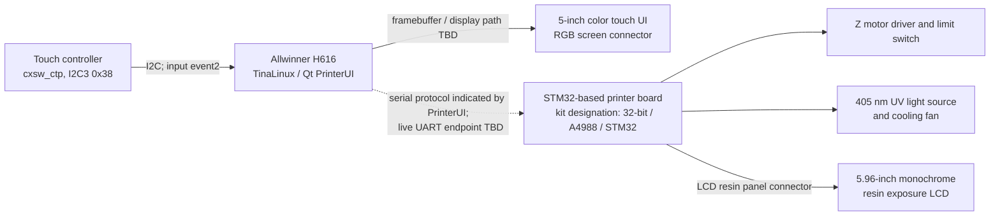

# Hardware map

## System topology

The drawing separates confirmed connector/function relationships from paths that still need direct board inspection. The software CPU is confirmed as H616. Creality's replacement-board name identifies an STM32 and A4988, but the board silkscreen on this individual printer has not yet been photographed.

## Display 1: operator touchscreen

- Published HALOT-ONE specification: 5-inch touch screen.
- Published spare-part description identifies a color touch panel; the user manual calls its motherboard connection `RGB screen port`.
- Live OS observation: `/dev/fb0`, 32 bits per pixel, virtual size `800x960`. This is consistent with an 800x480 panel using two framebuffer pages; physical timing and connector signals have not yet been read from the device tree.
- Live OS observation: input device `cxsw_ctp` is attached to I²C bus 3 at address `0x38` and appears as `/dev/input/event2`.
- The I²C binding identifies the touch controller driver name, but not the exact chip vendor/model.

## Display 2: resin exposure panel

- Published HALOT-ONE specification: 5.96-inch monochrome LCD, 1620x2560 pixels; exposure wavelength is 405 nm.
- The user manual labels a separate motherboard connection `LCD resin panel` / `printing screen port`.
- The OS has an I²C client named `dlp1438` at bus 0 address `0x1b`. A connection between that client and the exposure LCD is plausible but not established from the available read-only evidence. The name alone is not enough to identify a chip or bus path.
- The exact panel vendor, FPC pinout, timing/data interface, and whether the STM32 or H616-side display circuitry controls the panel remain open questions.

## Printer-control board and actuators

Creality lists replacement part `4002010045` as `HALOT-ONE Mainboard Kit_2.0_32_A4988_STM32`. The CL-60 wiring diagram labels these ports:

- RGB screen
- LCD resin panel / print screen
- Z-axis motor driver
- Z-axis upper limit switch
- UV LED power enable
- UV/light-board cooling fan
- exhaust fan
- DC power input
- USB host for a flash drive
- spare firmware/debug interface (manufacturer-only)

The STM32's exact part number, clock, firmware revision, and electrical assignments have not been confirmed on this unit. The `A4988` designation is part of the vendor's replacement-board name; it does not establish the exact number of populated driver chips or connector pinout on this PCB revision.

## Linux-side buses observed

| Bus/device | Live name | Current interpretation |
|---|---|---|
| I²C 0, `0x1b` | `dlp1438` | Present; precise chip and role TBD |
| I²C 2, `0x50` | `rk628` | Present; precise role in this display chain TBD |
| I²C 3, `0x38` | `cxsw_ctp` | Touch input controller; `/dev/input/event2` |
| I²C 5, `0x36` | `axp806` | Power-management IC driver name |
| UART | `ttyS0`, `ttyS1`, `ttyS2` | `ttyS0` is the Linux console from the kernel command line; printer MCU endpoint not yet identified |

These names are Linux driver/client labels observed under `/sys/bus/i2c/devices`; they are not all independently confirmed silicon part numbers.

## Physical verification needed

The next useful evidence is a sharp photo of both sides of the printer-control PCB, readable MCU and driver markings, and both screen cables at their connectors. The printer must be powered off and unplugged before opening it. Until that evidence exists, the connector names above come from the published wiring diagram, not a hands-on continuity trace.

## Sources

- [HALOT-ONE user manual](https://www.bhphotovideo.com/lit_files/839713.pdf)
- [Creality HALOT-ONE mainboard kit](https://www.crealitycloud.com/product/spare-parts/halot-one-mainboard-kit-62ee0546a99b803c8f3f4513)
- [Creality HALOT-ONE product specifications](https://www.creality.com/download/creality-halot-one-resin-3d-printer)
- [Creality wiring/UV troubleshooting diagram](https://wiki.creality.com/en/halot-series/halot-series-general-troubleshooting/the-uv-light-remains-on-even-after-turning-off-the-clear-screen-or-completing-the-print)
