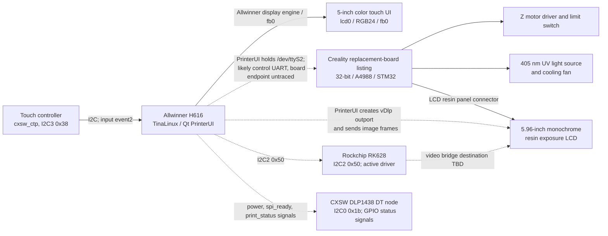

# Hardware map

## System topology

The solid display path is supported by the live framebuffer and flattened device tree. The app binary separately creates a `vDlp` image output port for layer frames, which is the leading software path for exposure images; its physical endpoint is untraced. Dashed links mark observed interfaces whose board destination is not proven. Creality's replacement-board listing identifies an STM32 and A4988, but the silkscreen on this individual printer has not been photographed.

## Display 1: operator touchscreen

- Published HALOT-ONE specification: 5-inch touch screen.
- Published spare-part description identifies a color touch panel; the user manual calls its motherboard connection `RGB screen port`.
- Live OS observation: `/dev/fb0` reports `800x480p-59`, 32 bits per pixel, virtual size `800x960`. The flattened device tree has enabled Allwinner `lcd0`, active size `800x480`, physical dimensions `108x65 mm`, 30 MHz pixel clock, and the `rgb24` pin group. This supports the H616-to-RGB operator-panel path; board-level connector pin numbers have not been traced.
- Live OS observation: input device `cxsw_ctp` is attached to I²C bus 3 at address `0x38` and appears as `/dev/input/event2`.
- While PrinterUI was running, its open file descriptors included `/dev/fb0`, `/dev/disp`, `/dev/ion`, `/dev/mali0`, `/dev/input/event2`, and `/dev/ttyS2`.
- Ghidra pseudocode shows `YuvDataSend::init()` creating a `CreatevDlpOutport` backend and `sendImageDataToDlp()` copying image pixels to that output path. `SerialPortPrintFile` passes layer images through `SendBgraImage`. The connection from this software output port to a physical FPC has not been traced.
- The I²C binding identifies the touch controller driver name, but not the exact chip vendor/model.

## Display 2: resin exposure panel

- Published HALOT-ONE specification: 5.96-inch monochrome LCD, 1620x2560 pixels; exposure wavelength is 405 nm.
- The user manual labels a separate motherboard connection `LCD resin panel` / `printing screen port`.
- Device tree and sysfs identify an I²C node `compatible = "cxsw,dlp1438"` at bus 0, address `0x1b`. Its board properties are named `power`, `spi_ready`, and `print_status`; no bound I²C driver appeared in sysfs during inspection. These names suggest a display-controller or readiness interface but do not prove the FPC/data path.
- A second node `compatible = "rockchip,rk628"` at I²C2 address `0x50` is bound to the `rk628` kernel driver. Rockchip describes RK628D as a video bridge with multiple display interfaces, but the unit's DT does not expose a confirmed endpoint from it to the exposure LCD. Its exact role remains open.
- The printer's product documentation calls this a monochrome LCD exposure panel. The `DLP1438` compatible string is a controller/node label and must not be read as proof that the optical panel is DLP technology.
- The exact panel vendor, FPC pinout, timing/data interface, and the division of work between the H616, RK628, CXSW node, and STM32 remain open questions.

## Printer-control board and actuators

Creality lists replacement part `4002010045` as `HALOT-ONE Mainboard Kit_2.0_32_A4988_STM32`. The CL-60 wiring diagram labels these ports:

- RGB screen
- LCD resin panel / print screen
- Z-axis motor driver
- Z-axis upper limit switch
- UV LED power enable
- UV/light-board cooling fan
- exhaust fan
- DC power input
- USB host for a flash drive
- spare firmware/debug interface (manufacturer-only)

The downloaded rootfs includes an STM32 updater and `V1-01.bin`, confirming a distinct STM32 application firmware path. Its startup script selects the H616 UART `/dev/ttyS2` for this product and toggles H616-side GPIOs `PA6` (BOOT0) and `PA0` (reset) when entering the STM32 ROM updater. The exact MCU part number, clock, PCB revision, board connector, MCU UART pins, voltage levels, and electrical assignments have not been confirmed on this unit. The `A4988` designation is part of the vendor's replacement-board name; it does not establish the exact number of populated driver chips or connector pinout on this PCB revision.

## Linux-side buses observed

| Bus/device | Live name | Current interpretation |
|---|---|---|
| I²C 0, `0x1b` | `cxsw,dlp1438` | DT node has `power`, `spi_ready`, `print_status`; no bound I²C driver observed; exposure-screen role plausible, physical route TBD |
| I²C 2, `0x50` | `rockchip,rk628` | Bound to `rk628`; video-bridge family, connection to either panel TBD |
| I²C 3, `0x38` | `cxsw_ctp` | Touch input controller; `/dev/input/event2` |
| I²C 5, `0x36` | `axp806` | Power-management IC driver name |
| UART | `ttyS0`, `ttyS1`, `ttyS2` | `ttyS0` is the Linux console; PrinterUI and the STM32 updater use `/dev/ttyS2` for the control path; physical endpoint, connector, signal level, and MCU pins remain untraced |

These names are Linux driver/client labels observed under `/sys/bus/i2c/devices`; they are not all independently confirmed silicon part numbers.

## Physical verification needed

The printer has not been opened. The next useful evidence, if the owner later chooses to open it, is a sharp photo of both sides of the printer-control PCB, readable MCU and driver markings, and both screen cables at their connectors. Until then, PCB revision, cable destinations, connector pin numbers, and STM32 UART pins remain unconfirmed; the manual's port names and the live Linux-side interfaces are documented separately.

## Sources

- [HALOT-ONE user manual](https://www.bhphotovideo.com/lit_files/839713.pdf)
- [Creality HALOT-ONE mainboard kit](https://www.crealitycloud.com/product/spare-parts/halot-one-mainboard-kit-62ee0546a99b803c8f3f4513)
- [Creality HALOT-ONE product specifications](https://www.creality.com/download/creality-halot-one-resin-3d-printer)
- [Creality wiring/UV troubleshooting diagram](https://wiki.creality.com/en/halot-series/halot-series-general-troubleshooting/the-uv-light-remains-on-even-after-turning-off-the-clear-screen-or-completing-the-print)
- [Rockchip RK628D video-bridge overview](https://www.rock-chips.com/a/cn/news/rockchip/2021/0402/1383.html)
- [UART, STM32 command, and ROM-loader protocol findings](protocols.md)
- [Firmware/update chain and boot path](firmware-update.md)
